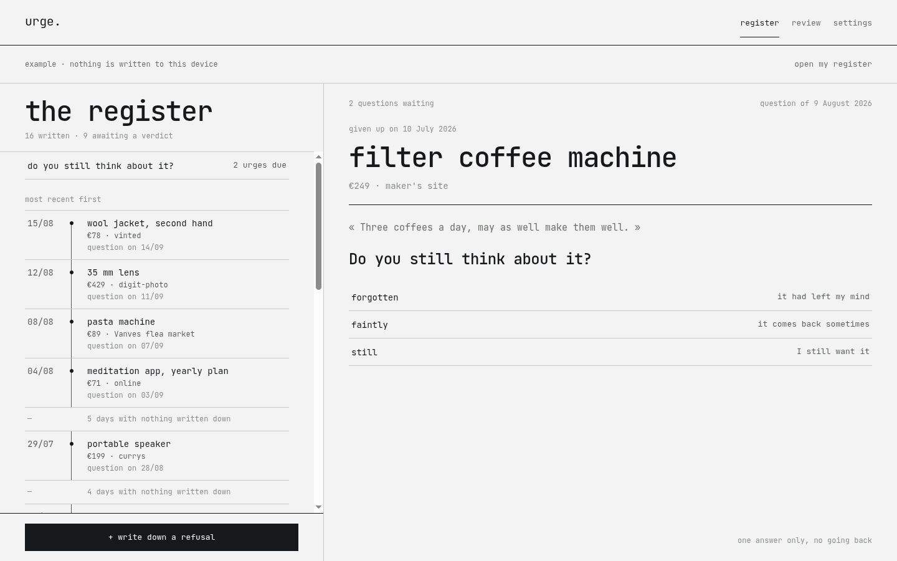
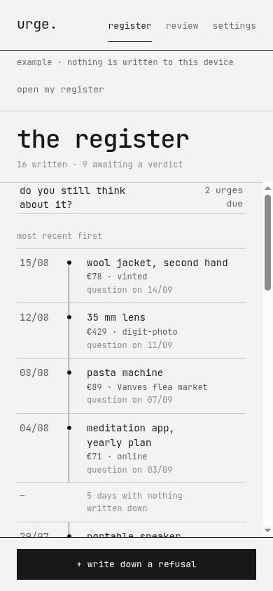
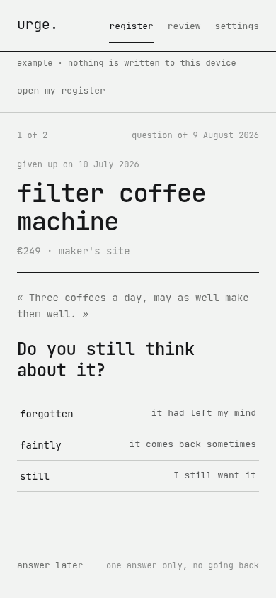

# urge.


**One urge. Thirty days. One question.**

urge. is not a wishlist. You write down what you *give up on*, at the moment you give it up. Thirty days later, one question comes back: *do you still think about it?* The answer is one word — forgotten, faintly, still.

No account, no network, no paid tier. Everything lives in your browser's local storage, and the only exchange format is a `urge.json` file that you export and import yourself.

<picture>
  <source
    media="(prefers-color-scheme: dark)"
    srcset="docs/screenshots/app-desktop-dark.png">
  
</picture>

---

## Contents

- [What it is](#what-it-is)
- [What it is not](#what-it-is-not)
- [Why thirty days](#why-thirty-days)
- [Screens](#screens)
- [Getting started](#getting-started)
- [Your data](#your-data)
- [Architecture](#architecture)
- [Design system](#design-system)
- [Accessibility](#accessibility)
- [Browser support](#browser-support)
- [Contributing](#contributing)
- [Licence](#licence)

## What it is

|  |  |
|---|---|
| **Unit** | one refusal, one question, one answer; nothing else is stored |
| **Answers** | `forgotten` · `faintly` · `still`; given once, no going back |
| **Vocabulary** | words, never colours; the register has no palette of its own |
| **Data** | `localStorage`, `schemaVersion` 1, JSON export and import |
| **Languages** | French, English, or the one your system asks for |
| **Install** | progressive web app, works offline once loaded |
| **Licence** | AGPL-3.0-or-later |

Two layouts, one behaviour. Above 900 px the register sits on the left and never moves; everything else — the question, one urge in full, the review, the settings — opens on the right. Below that, one screen at a time, the writing sheet comes up from the bottom, and the primary action stays under your thumb.

The register reads most recent first and never reorders itself. Answering fills in the verdict column and moves nothing: a line stays where you left it.

## What it is not

- no wishlist: nothing is written down at the moment you *want* something
- no "actually, I bought it in the end": that would turn a register into a regret
- no savings figure presented as a gain, no savings goal, no budget
- no price tracking, no link to any shop, no affiliate anything
- no streak, no score, no badge, no reward, no celebration
- no account, no sync, no sharing with anyone
- no tracker, no analytics, no advertising
- no emoji, anywhere

An urge you still want is not a failure. It is a piece of information.

## Why thirty days

An impulse almost never survives a month. Asked on the day itself, the question says nothing: everything looks necessary the moment you want it. Thirty days later the answer is clear, and it comes in one word.

The delay is a setting: fifteen, thirty or sixty days. It does not go below fifteen; any shorter and you are still questioning the urge rather than the memory of it.

**The date is fixed when the line is written**, not recomputed from the setting. Shortening the delay would make lines you thought were quiet fall due all at once; lengthening it would erase a question already owed. The setting applies to what you write next, never to what is written.

There is one deliberate departure from the mock-up. It sketched a *reminder*, set to "mornings, 9 a.m.". An app with no server cannot wake a phone at nine, so that switch would have promised a notification the program can never send. It is replaced by a setting that is true: **ask the question**, either when I open the app or when I ask for it.

## Screens

| | |
|---|---|
|  |  |
| The register: the date, the thing, what became of it. | The question, with the sentence you wrote that day. |

## Getting started

Node 20.19+ or 22.12+.

```bash
npm install
npm run dev        # http://localhost:5173
```

| Script | What it does |
|---|---|
| `npm run dev` | development server |
| `npm run build` | typecheck, then production bundle |
| `npm run preview` | serve the built bundle |
| `npm run typecheck` | `tsc --noEmit` |
| `npm test` | the whole suite, once |
| `npm run test:watch` | the suite, watching |
| `npm run icons` | regenerate the icons from the frozen outlines |

`/app?demo=1` opens the app filled with sixteen lines computed from today, two of them already due, without writing anything to the device. It is the fastest way to see a change in context.

## Your data

Everything is in `localStorage`, under the single key `urge.v1`, in exactly the format the export produces. What the app reads is what comes out of it:

```json
{
  "schemaVersion": 1,
  "data": {
    "entries": [
      {
        "id": "…",
        "name": "35 mm lens",
        "price": 429,
        "where": "digit-photo",
        "why": "To photograph people, not landscapes.",
        "renouncedAt": "2026-08-14",
        "askAt": "2026-09-13",
        "verdict": null,
        "answeredAt": null
      }
    ]
  },
  "settings": {}
}
```

`verdict` is one of `forgotten`, `faint`, `still`, or `null` while the question is still owed. The words are stored neutral rather than translated, because a file exported in French has to be readable in English. "oublié" is a rendering, not a stored value.

**Export** downloads `urge-YYYY-MM-DD.json`. **Send** hands the same file to the device's native share sheet when it can take one, and falls back to a download. **Import** validates the schema before anything is touched, then asks whether to merge or replace. Merging overwrites nothing: a line already judged keeps its verdict, even against a file that claims otherwise. A malformed line is dropped on its own rather than failing the whole import.

Clearing the site data deletes everything, permanently. That is the trade for having no server. Export from time to time.

## Architecture

```
src/
├── lib/          pure logic — no React, no DOM, no window
│   ├── types.ts      the model: Entry, Verdict, Settings
│   ├── format.ts     dates in local time, never through UTC
│   ├── entries.ts    write down, fall due, answer, remove, count
│   ├── io.ts         parse, serialise, merge, download, share
│   ├── storage.ts    the single localStorage key
│   └── sample.ts     the example data, computed from today
├── state/        one store, persisted on every change
├── i18n/         fr.ts is the reference, en.ts its typed mirror
├── components/   the shared design-system components
├── app/          the app: register, question, detail, review, settings
├── site/         the presentation site
└── styles/       tokens, base, components, app, site
```

`src/lib/` is pure by rule, which is why it carries most of the tests: the logic that can be wrong is tested without a browser. React in `lib/` means the logic is in the wrong place.

Dates are stored as `YYYY-MM-DD` and built from local date parts. Never `toISOString()`: it switches to UTC and moves every line written after 22:00 to the next day anywhere east of Greenwich.

`localStorage` rather than IndexedDB: one refusal a day for ten years fits in a few hundred kilobytes, the API is synchronous, so there is no loading state on open, and the stored format stays the file format, readable by eye.

## Design system

The "famille ." 1.2.0 system, shared with the other `.` micro-apps: monospace, right angles, two greys and an ink, no illustration, no shadow, no emoji. See `docs/Design System v1.2.dc.html`.

Every value comes from a token in `src/styles/tokens.css`. A hard-coded colour, size, duration or spacing in a component is a conformance defect.

urge. adds **nothing** to the family palette. Its vocabulary is made of words: forgotten, faintly, still. Nothing in the register needs a colour to be read.

Mock-ups live in `docs/urge.dc.html` and `docs/urge - mobile et desktop.dc.html`, and in the Claude Design project they came from.

## Accessibility

- 44 × 44 minimum touch targets, everywhere
- a visible 2 px focus ring, and focus trapped in the sheet then given back
- `Escape` closes the sheet; the close button and the cancel action stay the guaranteed paths
- every register row carries a full accessible name — "35 mm lens, written down on 14 August 2026, forgotten" — because the right-hand column is not read when tabbing through
- each answer is named in full too: "35 mm lens: still, I still want it". Three rows reading "forgotten / faintly / still" say nothing out of context
- no state is carried by colour alone, since there is no colour in the interface
- `prefers-reduced-motion` removes every transition

## Browser support

The last two versions of Chrome, Edge, Firefox and Safari, desktop and mobile. The build targets ES2022 and CSS for Chrome 111 and up. `:has()`, `color-mix()` and `100dvh` are used without fallback.

Web Share is used when the device offers it, and falls back to a download when it does not.

## Contributing

Read [CONTRIBUTING.md](CONTRIBUTING.md). It starts with the two rules that turn down most pull requests, so it is worth the two minutes before writing code.

Everyone taking part follows the [Code of Conduct](CODE_OF_CONDUCT.md). Vulnerabilities go through [SECURITY.md](SECURITY.md), never a public issue.

## Licence

[AGPL-3.0-or-later](LICENSE). You may use, study, modify and redistribute this software; any modified version you make available to others must be available under the same terms, source included.
